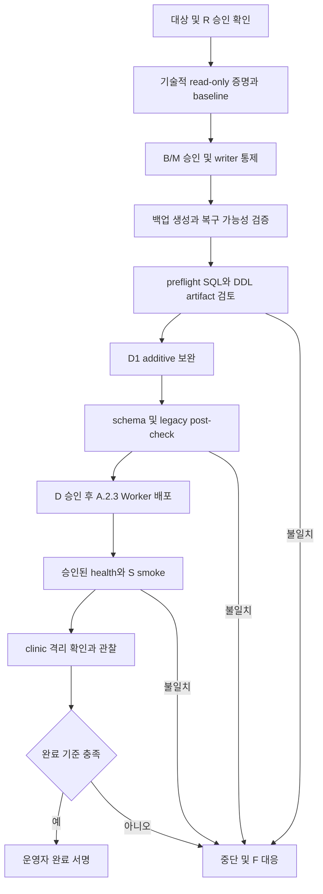

# CARESTEP v10.7-A.2.3 Production Runbook — 실행 비승인 초안

## 현재 판정과 범위

**A.2.3 로컬 검증 완료 / Production 실행 BLOCKED(남은 drift·용량·실행 승인 미확정).**
이번 A.2.3 수정 작업에서는 Production에 접속하지 않았다. 앞선 별도 승인 read-only
결과는 증거로 보존하되 만료된 승인을 이 후보의 실행 승인으로 재사용하지 않는다. 이 문서는
배포·조회·백업·복원·smoke test의 실행 승인이 아니다. 모든 SQL은 검토용
주석 상태이며 원격 명령 예시는 비활성 수동 초안이다. 실행 스크립트는 제공하지 않는다.

| 기준 | 확인 상태 |
| --- | --- |
| 브랜치 | `fix/v10.7-a2-regression-p1`, 시작 working tree clean |
| A.2.3 수정 시작 HEAD | `c3ca52b186e5075fd712b233cf935b064a46e75c` |
| Worker 버전 | CARESTEP_VERSION / CARESTEP_BUILD / EFSYNC_VERSION 모두 `10.7-A.2.3` |
| Worker SHA-256 | `57c1076d2026e2d5d3a2632690d873041533d229847c3d3afc26bf850ca3076a` |
| immutable A.2 SHA-256 | `9f54ddd87f542e749cf0c070a292d7d56e11e0409895fc34d929740e4dbc21a7` |
| PR #5 | Draft, base `fix/v10.7-worker-source-of-truth`; base 변경 금지 |
| PR #4 | Draft/BLOCKED, head `94cbdff853c0421719b6f808782a29ca8eaf3c42`; 변경 금지 |
| 검증 | regression 19 + local workerd/D1 13 + assignment 14 + trigger 40 + verifier 4 = 90 PASS / 0 FAIL |
| 이전 조회로 확인된 항목 | legacy ledger metadata, v2 부재, consult 컬럼 type/notnull/pk, patients 필수 계약, cases 26개 담당자 계약, preventive cleanup 정의 |
| 남은 항목 | 나머지 index/trigger drift, consult 기본값, 용량·여유, writer 통제·백업·복구, 실행 직전 대상·권한 재확인, 승인 |

이 작업은 preventive cleanup trigger 계약을 보완하여 Worker 버전과 해시를 변경했다. 이전 검증 환경·시나리오는
[readiness 증거](worker-a2-1-production-readiness.md), P1 설계는
[corrective 문서](worker-a2-1-corrective.md)에 있다. 로컬 D1 성공은 live 용량·권한·데이터의 증명이 아니다.
승인자는 아래 미확인 항목을 해소하기 전 배포에 서명하면 안 된다.

미배포 A.2.2는 위 시작 commit과 SHA-256
`677e602440017e1ff781524e8da04b00044939ade6d66a4065cdfa0dbbdcc3c9`로 보존한다.
[담당자 계약](worker-a2-2-assignment-contract.md)은 이전 별도 승인 조회에서 26/1/1/1/1로 확인됐다.
[preventive trigger 계약](worker-a2-3-preventive-trigger-contract.md)의 기존 Production 정의도
read-only 1건·쓰기 0건으로 확인됐다. 정의 SHA-256은
`FFE55186333E559309E628A9BECB6038F7B0DD88CA68024B7425606814BDB75D`이며 Git 생성 출처는 미확인이다.
해당 상태가 유지되면 A.2.3 upgrade는 기존 trigger에 대해 no-op이다.
SQL 07–32 자동 재개와 기존 외부 도구·allowlist 수정은 금지한다.

이번 작업에서 금지하고 실행하지 않은 항목: main push/merge, PR Ready/merge,
Worker deploy, Production DDL/DML/migration/FullReconcile, Agent·Secret·binding·환경변수·Cron 변경,
실제 SOLAPI/Toss/Google/Microsoft 발송·쓰기, 백업 생성·복원, A.2 rollback, Production smoke test.

## 승인과 대상 확인

승인은 서로 대체하지 않는다: **R**=특정 대상 read-only 조회, **B**=백업·민감 데이터 취급,
**M**=writer 통제 및 정확한 DDL 계획, **D**=Worker 배포, **S**=개별 smoke test,
**F**=장애 대응/복구. 현재 모두 미승인이다.

1. 운영자가 기존 관리대장과 Cloudflare 관리 화면의 계정→Worker→배포 환경→D1 binding `DB`
   연결을 대조한다. 단순 DB 이름이나 현재 CLI 로그인 계정만으로 대상을 결정하지 않는다.
2. 다른 운영자가 실제 account/Worker/DB 식별값, 환경, route, 배포 버전을 독립 대조한다.
   실제 값은 접근 제한된 승인 기록에만 둔다. Git/채팅/콘솔 로그에는 식별값 대신
   `[TARGET_RECORD]`, 승인 티켓 참조, 일치 여부만 기록한다.
3. CLI가 필요하다면 승인된 고정 버전·명시적 config·명시적 환경·인증 profile을 검토한다.
   cwd/기본 binding/자동 `.env` 탐색/preview fallback/자동 provisioning에 의존하지 않는다.
   인증값을 인자나 shell history에 넣지 않는다. UI/CLI의 원문 출력도 저장하지 않는다.
4. R 승인은 대상, 아래 SQL ID, 허용 시간, 조회 부하 한도, 출력 필터, 담당자, 유효기간을 지정한다.
   기술적으로 검증된 read-only 실행 경로 또는 제한된 조회 gateway가 있어야 한다.
   계정 권한 명칭만 보고 SQL 쓰기가 불가능하다고 가정하지 않는다. 권한이 넓거나 불명확하면 BLOCK.
5. Production에서 쓰기 SQL을 시험해 권한을 확인하지 않는다. 동일 권한·도구 동작을 비운영에서
   검증하고 접근정책 증거를 검토한다. read replica, GET, `--remote`, `--dry-run`,
   SQL에 SELECT가 포함되어 있다는 사실만으로 read-only를 보장하지 않는다.
6. D1 PRAGMA의 적용 범위는 현재 transaction이다. `PRAGMA query_only=ON`을 원격 연결의
   영구 보호로 사용하지 않는다. 아래에는 조회형 allowlist만 두며 PRAGMA setter,
   ANALYZE, optimize, VACUUM, checkpoint, writable_schema, ATTACH, extension 함수는 제외한다.
   근거: [D1 SQL/PRAGMA](https://developers.cloudflare.com/d1/sql-api/sql-statements/) 및
   [SQLite PRAGMA](https://www.sqlite.org/pragma.html).

수동 CLI 초안은 **아래 주석을 그대로 실행해도 아무 동작이 없다**. 운영자는 R 승인 후 별도의
통제된 콘솔에서 SQL 하나씩 재검토해야 한다. `--yes`, 전체 파일 일괄 실행, CI 원격 실행은 허용하지 않는다.
Wrangler execute에 SQL을 안전하게 검증해 주는 dry-run이 있다고 가정하지 않는다.

```text
# DISABLED / R 승인·두 운영자 대상 대조·read-only 권한 증거 필요
# [PINNED_WRANGLER] d1 execute [VERIFIED_DATABASE_ALIAS] --remote --config [REVIEWED_CONFIG] --env [VERIFIED_ENV] --command [ONE_APPROVED_READ_ONLY_SQL]
# 실제 인증값·account ID·database ID를 여기에 대입하거나 문서에 저장하지 않는다.
```

## 소스에서 추출한 요구 스키마

근거: 고정 해시의 `worker.txt` 내 SAAS_SCHEMA_STATEMENTS, ensureSaasDb,
efSyncEnsureSchema, efSyncLedgerMark, saasEmrSyncStatus. 아래 명세는 P1 대상과 직접 의존성이다.
다른 객체가 불필요하다는 뜻이 아니다. 전체 Production schema를 고정 소스의 table/column/index/trigger
선언 및 기존 migration 상태와 대조하고 예상하지 못한 차이는 별도 검토한다.

### care_followup_cases 담당자 계약

`assignee_user_id`, `vet_user_id` 모두 `TEXT NOT NULL DEFAULT ''`, PK=0이다.
빈 문자열은 미배정이며 기존 INSERT가 생략해도 성공해야 한다. 전체 컬럼은 26개이며
컬럼 위치는 통과 기준이 아니다. FK·담당자 index는 새로 요구하지 않는다.
테이블 생성 이후 누락 컬럼만 additive 보완한다. 기존 정의 불일치는
`FOLLOWUP_ASSIGNMENT_SCHEMA_CONTRACT_MISMATCH`로 BLOCK하며 재정의·삭제·데이터 복사는 금지한다.
이전 승인된 숫자 조회로 두 컬럼의 존재·계약이 확인됐다. 자동 재조회하지 않는다.
기존 정의가 호환되면 두 컬럼의 ALTER는 없어야 하며, post-check에서도 계약을 확인한다.
메타데이터 검사는 임의의 기존 CHECK/FK/UNIQUE 제약까지 보증하지 않으므로 별도 drift 검토가 필요하다.

### preventive cleanup trigger 계약

`trg_care_home_preventive_push_patient_delete`는 AFTER DELETE ON care_patients이며
본문은 care_home_preventive_push_deliveries에서 `patient_id = OLD.id`인 이력을 삭제하는 한 문장뿐이다.
현재 Production의 확인된 정의는 변경하지 않는다. 누락된 다른 병원·fresh DB에는 두 테이블 생성 후 추가한다.
기존 객체와 의존 테이블은 bootstrap batch 전에 검사하고 생성 이후 다시 검사한다.
care_patients.id는 TEXT 단독 PK, delivery.patient_id는 TEXT여야 한다.
공백·대소문자·식별자 따옴표·IF NOT EXISTS 등 지원되는 동등 표현은 허용하지만,
이벤트/테이블/WHERE/statement 수 불일치는 `PREVENTIVE_PUSH_DELETE_TRIGGER_CONTRACT_MISMATCH`로 BLOCK한다.
자동 DROP·교체·데이터 복사·기존 orphan 청소는 하지 않는다. 환자 삭제·병합은 격리 DB에서만 시험했다.

### ledger 전체 컬럼

모든 컬럼의 affinity는 TEXT이다. `''`는 빈 문자열 기본값, `—`는 명시적 기본값 없음이다.
기존 v1 `record_key TEXT PRIMARY KEY`는 SQLite 일반 rowid table에서 명시적 NOT NULL과
동일하지 않으므로 기존 nullable 메타데이터를 임의로 강화하지 않는다.

| 컬럼 | v1 요구 | v2 요구 | 기본값 | 순서 / 데이터 영향 / 실패 위험 / 검증 |
| --- | --- | --- | --- | --- |
| record_key | 단독 PK, 원형 유지 | NOT NULL, 복합 PK 두 번째 | — | 테이블 생성 시; v1 재작성 금지; 전역 충돌 위험; Q2 PK/NULL 집계 |
| clinic_id | NOT NULL | NOT NULL, 복합 PK 첫 번째 | — | 테이블 생성 시; 소유자 추정 금지; tenant 혼선; Q2/Q6 |
| entity_kind | NOT NULL | NOT NULL | — | 테이블 생성 시; 행 불변; kind 손실; Q2 |
| external_id | nullable | nullable | `''` | 테이블 생성 시; payload 출력 금지; source 식별 손실; Q2 |
| source_ref | nullable | nullable | `''` | 위와 동일; event 식별 손실; Q2 |
| carestep_id | nullable | nullable | `''` | 위와 동일; 환자/보호자 연결 혼선; Q2 |
| source_hash | nullable | nullable | `''` | 위와 동일; 관측 추적 차이; Q2 |
| status | NOT NULL | NOT NULL | `'seen'` | 위와 동일; 상태 집계 오류; Q2/Q5 |
| run_id | nullable | nullable | `''` | 위와 동일; 실행 추적 혼선; Q2 |
| last_seen_at | NOT NULL | NOT NULL | — | 위와 동일; 최근 상태 오류; Q2/Q5 |
| last_success_at | nullable | nullable | `''` | 위와 동일; 성공 시각 손실; Q2 |
| last_error | nullable | nullable | `''` | 위와 동일; 오류 내용 출력 금지; Q2만 사용 |

### 객체별 적용 조건

| 객체명 | 요구 상태 | 생성/보완 순서 | 기존 데이터 영향 | 실패 위험 | 적용 후 검증 |
| --- | --- | --- | --- | --- | --- |
| efriends_sync_ledger | 위 v1 구조와 record_key PK 보존 | 기존 상태 확인; 없을 때만 별도 drift 판정 | 기존 행·키 변경/삭제 없음 | 과거 충돌·증거 손실 | Q1/Q2/Q5, 봉인된 백업과 별도 안전 비교 |
| idx_efsync_ledger_clinic_status | v1(clinic_id,status,last_seen_at DESC) | v1 뒤; 기존 정의 유지 | 행 변경 없음, index 저장공간 | 조회 저하·동명 오정의 | Q3 정의/방향 |
| efriends_sync_ledger_v2 | 위 구조, PRIMARY KEY(clinic_id,record_key) | v1 보존 확인 뒤 신규 테이블 | 자동 복사 없음, 신규 관측만 저장 | cross-clinic overwrite | Q1/Q2/Q6 |
| idx_efsync_ledger_v2_clinic_status | v2(clinic_id,status,last_seen_at DESC) | v2 뒤 | 행 불변, 저장공간 증가 | 상태 조회 비용 | Q3 |
| idx_efsync_ledger_v2_clinic_seen | v2(clinic_id,last_seen_at DESC) | v2 뒤 | 행 불변, 저장공간 증가 | ledgerLastSeen 비용 | Q3 |
| care_home_followups.consult_status | TEXT NOT NULL DEFAULT 'new' | fresh CREATE에 포함 / legacy PRAGMA 확인 후 없는 경우만 ALTER | 기존 행 조회에 기본값 제공 | index 생성 실패·상태 해석 변화 | Q2, 기본값·notnull까지 비교 |
| care_home_followups.consult_updated_at | TEXT DEFAULT '' | 위와 동일, index 전 | 기존 행 조회에 빈 기본값 | index 생성 실패 | Q2 |
| care_home_followups.consult_visit_date | TEXT DEFAULT '' | 같은 upgrade에서 결손 확인 | 기존 행 조회에 빈 기본값 | consult UI 차이 | Q2 |
| idx_care_home_followups_consult_status | (clinic_id,consult_status,consult_updated_at DESC) | 두 컬럼 보장 뒤 | 행 불변 | 초기화 실패 | Q3 |
| idx_care_home_followups_action | (clinic_id,clinic_action_status,due_date) | clinic_action_status 보장 뒤 | 행 불변 | 운영 큐 조회 실패 | Q3 |
| idx_care_home_followups_snooze | (clinic_id,clinic_action_status,clinic_snoozed_until) | 관련 컬럼 보장 뒤 | 행 불변 | snooze 조회 실패 | Q3 |
| care_patients / care_followup_cases | 기존 전체 정의와 관련 clinic/id 컬럼 보존 | 두 대상 테이블을 trigger 전에 보장 | 기존 행 삭제 없음 | trigger 참조 오류 | Q1/Q2 |
| trg_care_followup_cases_patient_delete | AFTER DELETE ON care_patients → care_followup_cases의 clinic_id=OLD.clinic_id AND patient_id=OLD.id 행 삭제 | 대상 테이블 생성 뒤, 기존 trigger 정의 불변 | 생성만으로 삭제하지 않음; 이후 환자 DELETE 시 기존 동작 수행 | 잘못된 범위 삭제 | Q3에서 이벤트·테이블·WHERE 전체 비교; Production DELETE로 시험 금지 |
| trg_care_home_preventive_push_patient_delete | AFTER DELETE ON care_patients → deliveries의 patient_id=OLD.id 한 문장 삭제 | 기존 정의 선검사 → 두 테이블 생성 → 누락 trigger만 생성 → 재검사 | 호환 기존 객체 no-op; 생성 시 기존 행 불변 | 오정의 시 고정 코드 BLOCK, 교체 금지 | 새 A.2.3 Phase 1C 기대 trigger 8개에 포함; 실제 DELETE 시험 금지 |

Fresh 순서: 의존 테이블 생성(consult 컬럼 포함) → 대상 테이블 이후 trigger → PRAGMA로 컬럼 확인 →
부족한 컬럼만 보완 → dependent index → v1 유지 및 v2/두 index 생성.
이는 전체 schema를 일괄적으로 모든 테이블→모든 index→모든 trigger로 재정렬했다는 뜻이 아니다.
Legacy: preventive 계약 선검사 → 테이블 batch → 누락 preventive trigger만 생성/재검사 →
각 결손 컬럼만 보완 → consult index → additive v2/index → cold 재실행 비교.
각 initializer는 별도 batch를 사용한다. 전체 upgrade가 하나의 원자적 transaction이라고 가정하지 않는다.

Idempotency는 CREATE IF NOT EXISTS와 PRAGMA 기반 결손 ALTER에 의존한다.
동명 객체의 잘못된 정의는 IF NOT EXISTS가 고쳐주지 않는다. 여러 isolate의 동시 ALTER도 보장하지 않는다.
기존 객체 정의 불일치/동시 writer 통제 불가는 BLOCK. 운영용 SQL artifact는 실제 drift 조회 뒤
별도 승인·비운영 재검증을 거쳐야 하며 이 문서는 자동 migration을 생성하지 않는다.

**v1은 audit 증거로 보존하며 v2로 자동 복사하지 않는다.** 이미 소유자와 carestep_id/run_id가
섞였을 수 있다. 이후 정상 sync/retry만 v2를 갱신하며 lastSeen 초기 빈 값은 허용한다.
FullReconcile로 채우지 않는다. 기존 map/checkpoint/failure/quarantine/run 구조는 그대로 유지한다.

## 역사적 read-only SQL 초안 — 현재 실행 목록 아님

아래 Q1–Q7은 최초 Runbook의 설계 기록이다. 기존 고정 도구·SQL 승인과 동일하다고 가정하지 않는다.
다음 실행 목록은 새 A.2.3 Phase 1C 도구를 별도 작성·오프라인 검증한 뒤 승인받는다.

현재 원격 실행하지 않았다. 아래 각 줄은 비활성 `--` 주석이다. R 승인 범위 안에서만
운영자가 한 문장씩 수동 사용한다. 먼저 Q1으로 객체 존재·type을 확인한다. 없거나 view로
바뀐 객체에 후속 COUNT를 실행하지 않는다. 객체 SQL은 스키마 메타데이터만 제한 검토하고
예상 밖의 literal이 있으면 출력·공유를 중단한다. 사용자 table의 SELECT *는 금지한다.

**Q1: 객체 inventory.** pre-v2 미존재는 예상 WARN, 승인된 보완 후에는 BLOCK.

```sql
-- R-APPROVAL-REQUIRED / DISABLED
-- SELECT type,name,tbl_name FROM sqlite_master WHERE name IN ('efriends_sync_ledger','efriends_sync_ledger_v2','care_home_followups','care_patients','care_followup_cases','system_migrations') ORDER BY name;
```

**Q2: 컬럼/PK.** below PRAGMA는 getter만 허용한다. 인자 `table_info(...)`는 테이블 식별자이며
설정값 대입이 아니다. v2 PK 순번 clinic_id=1, record_key=2; v1은 원형 PK 유지.

```sql
-- R-APPROVAL-REQUIRED / DISABLED; Q1 존재 확인 후 각각 실행
-- PRAGMA table_info('efriends_sync_ledger');
-- PRAGMA table_info('efriends_sync_ledger_v2');
-- PRAGMA table_info('care_home_followups');
-- PRAGMA table_info('care_patients');
-- PRAGMA table_info('care_followup_cases');
```

**Q3: index/trigger 정의.** 이름 존재만으로 PASS 금지. Q2의 전체 관련 컬럼과 다음 순서·DESC·
uniqueness·partial 조건·trigger body를 표와 비교한다. 특히 동명 오정의는 BLOCK이다.

```sql
-- R-APPROVAL-REQUIRED / DISABLED
-- SELECT type,name,tbl_name,sql FROM sqlite_master WHERE name IN ('idx_efsync_ledger_clinic_status','idx_efsync_ledger_v2_clinic_status','idx_efsync_ledger_v2_clinic_seen','idx_care_home_followups_consult_status','idx_care_home_followups_action','idx_care_home_followups_snooze','trg_care_followup_cases_patient_delete') ORDER BY name;
-- PRAGMA index_list('efriends_sync_ledger_v2');
-- PRAGMA index_xinfo('idx_efsync_ledger_v2_clinic_status');
-- PRAGMA index_xinfo('idx_efsync_ledger_v2_clinic_seen');
-- PRAGMA index_xinfo('idx_care_home_followups_consult_status');
```

**Q4: 용량.** 조회 PRAGMA만 사용한다. page_count × page_size는 DB 할당량 추정이고
청구 storage/여유 quota와 동일하지 않다. D1 환경에서 getter 미지원이면 WARN 후 승인된
관리 화면의 집계 storage와 한도를 확인한다. 필요한 여유량·허용 쿼리 시간은 승인 기록에서
숫자로 정해야 한다. 미정/한도 근접이면 BLOCK; 실제 수치는 아직 미확인이다.

```sql
-- R-APPROVAL-REQUIRED / DISABLED; setter, VACUUM, ANALYZE 사용 금지
-- PRAGMA page_count;
-- PRAGMA page_size;
-- PRAGMA freelist_count;
```

**Q5: aggregate baseline.** Q1 확인된 table마다 실행. 실제 row/clinic ID/외부 ID/오류 payload를
출력하지 않는다. status도 임의 문자열 노출을 피하도록 고정 CASE label만 사용한다.
writer 통제된 구간의 v1 count 변화는 BLOCK. 동일 count만으로 내용 불변이 증명되지는 않는다.

```sql
-- R-APPROVAL-REQUIRED / DISABLED
-- SELECT COUNT(*) AS legacy_rows,COUNT(DISTINCT clinic_id) AS clinic_count,SUM(CASE WHEN record_key IS NULL THEN 1 ELSE 0 END) AS null_keys FROM efriends_sync_ledger;
-- SELECT COUNT(*) AS v2_rows,COUNT(DISTINCT clinic_id) AS clinic_count FROM efriends_sync_ledger_v2;
-- SELECT COUNT(*) AS followup_rows FROM care_home_followups;
-- SELECT COUNT(*) AS patient_rows FROM care_patients;
-- SELECT COUNT(*) AS case_rows FROM care_followup_cases;
-- SELECT CASE WHEN status IN ('seen','synced','retry','dead_letter','quarantined') THEN status ELSE 'other' END AS state_bucket,COUNT(*) AS n FROM efriends_sync_ledger_v2 GROUP BY 1;
-- SELECT CASE WHEN status IN ('retry','dead_letter','resolved') THEN status ELSE 'other' END AS state_bucket,COUNT(*) AS n FROM efriends_sync_failures GROUP BY 1;
-- SELECT COUNT(*) AS pending_quarantine FROM efriends_sync_quarantine WHERE status='pending';
```

**Q6: 충돌/혼선 가능성(count만).** global PK는 이미 덮어쓴 행을 숨긴다. v1의 중복 key=0은
안전 증명이 아니다. 여러 clinic의 map에 같은 external ID가 있으면 전역 key 설계의 위험 신호다.
다른 clinic간 source ID 중복 자체는 합법이며 v2에서 정상이다. 소유권 mismatch>0은 데이터
검토 BLOCK이고 자동 수정·복사는 금지한다. missing map>0은 WARN 후 증거 검토; 원인 미해결이면 BLOCK.
event source_ref 과거 손실까지 이 SQL로 재구성할 수 없다는 한계를 승인자가 수용해야 한다.

```sql
-- R-APPROVAL-REQUIRED / DISABLED; 각 map/run table 존재·정의 확인 후 실행
-- SELECT COUNT(*) AS reused_patient_ids_across_clinics FROM (SELECT external_patient_id FROM efriends_sync_patient_map GROUP BY external_patient_id HAVING COUNT(DISTINCT clinic_id)>1);
-- SELECT COUNT(*) AS reused_guardian_ids_across_clinics FROM (SELECT external_guardian_id FROM efriends_sync_guardian_map GROUP BY external_guardian_id HAVING COUNT(DISTINCT clinic_id)>1);
-- SELECT COUNT(*) AS ambiguous_event_refs FROM (SELECT source_ref FROM efriends_sync_ledger WHERE entity_kind='event' AND source_ref<>'' GROUP BY source_ref HAVING COUNT(DISTINCT clinic_id)>1);
-- SELECT COUNT(*) AS patient_ownership_mismatch FROM efriends_sync_ledger l JOIN efriends_sync_patient_map m ON m.clinic_id=l.clinic_id AND m.external_patient_id=l.external_id WHERE l.entity_kind='patient' AND l.carestep_id<>'' AND l.carestep_id<>m.carestep_patient_id;
-- SELECT COUNT(*) AS guardian_ownership_mismatch FROM efriends_sync_ledger l JOIN efriends_sync_guardian_map m ON m.clinic_id=l.clinic_id AND m.external_guardian_id=l.external_id WHERE l.entity_kind='guardian' AND l.carestep_id<>'' AND l.carestep_id<>m.carestep_guardian_id;
-- SELECT COUNT(*) AS run_clinic_mismatch FROM efriends_sync_ledger l JOIN efriends_sync_runs r ON r.id=l.run_id WHERE l.clinic_id<>r.clinic_id;
-- SELECT COUNT(*) AS patient_map_missing FROM efriends_sync_ledger l WHERE l.entity_kind='patient' AND NOT EXISTS (SELECT 1 FROM efriends_sync_patient_map m WHERE m.clinic_id=l.clinic_id AND m.external_patient_id=l.external_id);
-- SELECT COUNT(*) AS duplicate_v2_pairs FROM (SELECT clinic_id,record_key FROM efriends_sync_ledger_v2 GROUP BY clinic_id,record_key HAVING COUNT(*)>1);
```

**Q7: bootstrap의 별도 DML 위험.** `ensureSaasDb`는 DDL 검사만 하는 함수가 아니다.
system_migrations 확인 뒤 plan_catalog 등 정책 데이터를 INSERT/UPDATE할 수 있다.
전체 함수의 호출 또는 일반 UI GET을 preflight의 read-only SQL 대체로 쓰지 않는다.

```sql
-- R-APPROVAL-REQUIRED / DISABLED
-- SELECT COUNT(*) AS applied_migration_count FROM system_migrations;
-- SELECT COUNT(*) AS pricing_policy_present FROM system_migrations WHERE key='v8.6_pricing_founding_policy';
```

Q7 count만으로 모든 migration 적용을 증명하지 못한다. 소스의 각 migration key 존재 여부를
count로 확장 검토하는 계획을 별도 승인받고, 결손 시 예상 DML 영향까지 검토한다.
전체 initializer를 운영용 DDL-only migration으로 실행하는 것은 BLOCK이다.

공통 판정: PASS=승인된 기대 상태 일치, WARN=알려진 pre-upgrade 결손/legacy 한계(서면 수용 필요),
BLOCK=대상·권한 미확인, 오정의, 예상 밖 결손/변화, 시간·용량 예산 초과, 개인정보 출력 위험.
이번 A.2.3 작업의 Production 실행은 전부 NOT RUN이다. 앞선 read-only 결과는 제한된
기록에서 별도 검토하며 새 후보에 대한 승인으로 간주하지 않는다.
쿼리의 timeout도 재시도/권한확대 사유가 아니다.

## 백업·복구 절차 초안 — 현재 미실행

Cloudflare의 [Time Travel](https://developers.cloudflare.com/d1/reference/time-travel/)은 해당
storage backend에서 자동 bookmark를 제공한다. 실제 backend·보존기간·복구권한은 R/B 승인 후
운영자가 확인해야 한다. bookmark 조회를 수동 백업 생성 완료로 표시하지 않는다.

1. B 승인으로 백업 담당자·보관 위치·암호화·접근권한·보존/폐기 정책을 확정한다.
   백업은 개인정보를 포함할 수 있으므로 repo, CI artifact, 채팅, 일반 로그에 보관하지 않는다.
2. 승인된 writer 통제가 성립한 배포 직전 시점에 UTC 시간과 Time Travel bookmark를 제한된
   기록에 보관하고, 승인된 D1 export로 독립 사본을 만든다. exporter 버전, 대상 재확인과
   write pause 일관성을 검토한다. exporter가 일관된 사본을 보장하지 못하면 BLOCK.
3. 종료 성공·파일 크기·암호학적 checksum·저장소 무결성·접근통제·시점/대상 일치를 확인한다.
   Git에는 실제 bookmark/파일경로/DB ID 대신 `[BACKUP_EVIDENCE]` 참조와 PASS 여부만 남긴다.
4. 별도 B/F 승인 아래 외부 요청이 차단된 격리 환경으로 복구 가능성을 시험한다.
   schema, aggregate count, PK/index/trigger, 읽기 검사를 수행하고 실제 row 내용은 출력하지 않는다.
   파일이 존재한다는 사실만으로 복구 가능 PASS를 주지 않는다.
5. 복구 권한은 비운영/정책 증거로 검증하고 복구 책임자가 서명한다. 실제 Production 복원은
   이 단계에 포함하지 않는다. RTO는 격리 복구 실측+대상 크기 검토, RPO는 승인된 cutoff로 정한다.
   현재 RTO/RPO는 미측정이며 숫자를 추정하지 않는다. 미확정 시 rollout BLOCK.

```text
# DISABLED / B 승인·대상 재확인·민감 백업 저장소 승인 필요
# [PINNED_WRANGLER] d1 time-travel info [VERIFIED_DATABASE_ALIAS] --config [REVIEWED_CONFIG] --env [VERIFIED_ENV]
# [PINNED_WRANGLER] d1 export [VERIFIED_DATABASE_ALIAS] --remote --output [RESTRICTED_BACKUP_PATH] --config [REVIEWED_CONFIG] --env [VERIFIED_ENV]
# restore 명령은 의도적으로 제공하지 않는다. F 승인 및 별도 복구 계획 없이는 실행 금지.
```

export 문법은 [공식 Wrangler D1 명령](https://developers.cloudflare.com/d1/wrangler-commands/)을
검토한 초안이다. 선택한 고정 CLI 버전의 옵션을 비운영에서 확인한 뒤만 사용한다.
백업 실패/불완전/시점 불명/복구권한 불명/복구시험 실패 시 즉시 중단한다.

복구 우선순위는 **A.2.3 유지 + 영향 경로 격리 + 증거 보존 + forward-fix**다.
이미 승인·시험된 ingress 제한 또는 유지보수 통제가 있는지 확인하되 존재한다고 가정하지 않는다.
Agent/Cron/Secret을 임의 변경하는 해결책은 제시하지 않는다. 통제 수단이 없으면 배포 전에 BLOCK.
장애 시 F 승인을 받아 영향 경로만 제한하고 정상 서비스의 범위를 명시한다. 전체 DB 복원은
백업 이후 정상 쓰기를 잃을 수 있어 보존·재적용 계획과 새 F 승인 없이 수행할 수 없다.
forward-fix는 원인 재현, 영향 범위 확인, 기존 행 보존, 별도 버전/해시, 격리·CI PASS,
서면 검토 후에만 가능하다. 무손실을 증명하지 못하면 중단 상태를 유지한다.

**A.2 단순 코드 rollback 금지:** v2가 있어도 A.2는 v1 전역 PK로 다시 쓰므로 clinic 충돌이
재발한다. v2 신규 관측도 A.2가 보지 못한다. schema additive 호환성과 안전한 서비스 복구는 별개다.

## 적용 순서와 단계별 gate — 모두 미래 승인 대상

결론은 **조건부 D1 먼저, Worker 나중**이다. v2 신규 테이블/컬럼/index는 A.2의 기존 schema를
제거하지 않으며 A.2.3은 v2를 요구하므로 schema post-check를 먼저 하는 편이 낫다.
그러나 A.2 writer가 계속 쓰는 전환 구간은 안전하지 않다. writer 통제 및 정확한 Production
drift 기반 DDL-only artifact가 아직 없으므로 **실제 실행 계획은 BLOCKED**다.
Worker-first lazy bootstrap이나 임의의 전체 ensureSaasDb 실행으로 우회하지 않는다.



모든 단계에 공통: 이전 PASS와 해당 승인이 있어야 진입한다. 증거는 민감정보 없는 결과와 제한된
기록의 참조만 보관한다. 실패 시 다음 단계로 진행하지 않으며 자동 재시도/자동 rollback하지 않는다.

| 단계 | 주체·승인 | 수동 방법 | 기대 결과·증거 | 실패 시 중단 / 다음 단계 조건 |
| --- | --- | --- | --- | --- |
| 1 대상 재확인 | 운영자+검토자, R | 계정/Worker/env/DB binding 대조 | 두 사람 일치 서명, TARGET_RECORD | 불일치 BLOCK / 일치해야 2 |
| 2 승인 확인 | 변경 책임자, R/B/M/D/S 범위 | 티켓·시각·유효기간·권한 증거 | 허용 작업과 담당자 확정 | 누락 BLOCK / 읽기 권한 증명 후 3 |
| 3 baseline | 운영자, R 및 health 대상 승인 | Q1–Q7 중 승인 목록, 허용 health 하나 | version/status·집계·schema hash 참조 | 오류·민감정보 BLOCK / writer 통제 M 확정 후 4 |
| 4 백업 | 백업 담당자, B/M | writer 통제 후 위 백업·검증 절차 | 시점/무결성/복구시험 PASS | 백업·권한 실패 BLOCK / 검증된 사본 후 5 |
| 5 preflight | DB 담당자+검토자, R/M | 통제 구간 Q1–Q7 재대조, 정확한 DDL plan hash 검토 | 예상 drift만 존재·baseline 확정 | 미예상 차이 BLOCK / DDL artifact 격리 재현 후 6 |
| 6 D1 보완 | DB 담당자, M | 승인된 결손 컬럼→index, v2→index, 필요한 trigger만 수동 적용 | 단계별 성공·실행된 객체 목록 | batch 실패/통제 상실 즉시 BLOCK / 모두 성공 후 7 |
| 7 schema post-check | 독립 검토자, R | Q1–Q6 및 승인된 보존 검증 | v1 불변, v2 신규 시 0행, 기대 PK/정의 | count 변화·자동복사·오정의 BLOCK / PASS 후 8 |
| 8 Worker 배포 | 배포 담당자, D | 고정 artifact hash·설정 diff 확인, 선택한 배포 경로 수동 실행 | 10.7-A.2.3, binding/Secret/Cron 변경 없음 | SHA/설정 불일치 BLOCK / 배포 식별 증거 후 9 |
| 9 health | 운영자, 승인된 R health | 정확한 eFriends health만, 원문 저장 금지 | HTTP 200·version 일치·대상 clinic 일치 boolean | 실패 BLOCK / D1 연결은 별도 Q 검사 후 10 |
| 10 최소 smoke | 테스트 담당자, 개별 S | 아래 분류에서 승인된 항목만 | 결과/부작용 없는 집계 증거 | 외부 요청·예상 밖 쓰기 BLOCK / PASS 후 11 |
| 11 clinic isolation | DB 담당자, R/S | 합성 검사 또는 승인된 정상 관측의 scoped 집계 | A/B 서로 변경 없음, 기대 lastSeen | 혼선 BLOCK / scoped PASS 후 12 |
| 12 관찰 | 운영 책임자, D/S | 승인된 창 동안 오류·큐·저장량 관찰 | 최소 정상 스케줄 2회 및 승인된 추가 시간, 임계치 이내 | 임계치/창 미정 BLOCK / 완료 조건 후 13 |
| 13 완료/중단 | 변경 책임자 | 증거·미해결 WARN·F 필요 여부 검토 | 완료 서명 또는 중단 티켓 | 미해결 위험이면 완료 금지 |

8단계 deploy 명령은 대상과 배포 방식이 검증되지 않아 작성하지 않는다. 승인된 운영자가
선택한 경로의 비운영 dry-run으로 artifact/설정 차이를 먼저 검토해야 한다. dry-run은 배포 승인이 아니다.
6단계도 실제 drift 전에는 복사 실행 가능한 DDL을 제공하지 않는다. main/PR merge가 전제라고
가정하지 않으며 저장소 정책상 merge가 필요하면 현재 금지와 충돌하므로 추가 승인 전 BLOCK이다.

## smoke-test 분류 — 현재 전부 NOT RUN

분류 A의 '추가 자동 승인 없이 가능한 read-only'는 **이미 유효한 R 승인·대상·기술적 read-only
보호가 확보된 경우**에만 해당한다. 현재 R 미승인이므로 A도 실행하지 않는다.

| 검사 | 분류 | 확인 방법과 PASS / 제한 |
| --- | --- | --- |
| Q schema/aggregate | A: R 범위 내 read-only | 승인 SQL만, 객체 정의·count 기대 일치 |
| eFriends GET /efriends/v1/health | A: 별도 승인된 endpoint 범위 | 소스상 auth 후 schema 호출 없이 반환; 200/version과 clinic 일치 여부만 기록. db:true는 binding 존재만 의미하며 D1 연결 증명이 아님 |
| GET status/checkpoint, Home/HQ/CRM UI | B: 별도 S 필요 | GET도 ensure 함수로 DDL/DML 가능; read-only로 분류하지 않음. status payload 원문은 보관 금지 |
| 합성 clinic A/B + 동일 record_key | B, 기본은 격리 DB 대체 | 공유 Production DB에는 합성이라도 쓰기 발생. clinic 라우팅·외부 처리 차단을 입증하고 S 승인 없이는 금지. env/binding 바꿔 A/B를 흉내내지 않음 |
| 정상 sync | B: 제한된 S | 쓰기 경로이므로 범위·기대 신규 관측·중복 방지·실패 기준 명시; 기존 Agent를 변경하거나 즉시 강제 실행하지 않음 |
| retry-due | B: 제한된 S, 기본 격리 대체 | 실제 대기 행을 소비함. limit만으로 합성 범위를 보장하지 못함; 안전한 격리 범위를 입증 못하면 Production 금지 |
| dead-letter 유도 | C: Production 금지/격리 대체 | 의도적 반복 실패는 업무 큐 오염; 로컬 13개 증거 사용 |
| quarantine 유도 | C: Production 금지/격리 대체 | 고의 identity 충돌·메시지/환자 데이터 생성 금지 |
| clinic isolation 조회 | A 또는 B | 기존 데이터의 승인 aggregate는 A; 합성 쓰기 검증은 B. raw clinic/key/patient 내용 출력 금지 |
| ledgerLastSeen 초기 빈 값 | A(Q), status 호출은 B | v2 해당 clinic 관측 0이면 빈 값 허용; 정상 sync/retry 뒤 자기 clinic만 갱신. 빈 값 자체는 장애 아님 |
| SOLAPI/Kakao 발송, Toss 결제, Google/Microsoft calendar/OAuth 쓰기, 보호자 메시지 | C: 승인 전 금지/비운영 대체 | sandbox 계정·mock부터; 본 Runbook은 live 발송/결제 승인을 포함하지 않음 |
| FullReconcile·환자 DELETE로 trigger 시험 | C: Production 금지 | 격리 fixture 증거로 대체 |

health의 clinicId, status의 오류/backup/message 필드 등은 응답에 식별정보가 포함될 수 있다.
원문 response를 curl verbose/터미널 녹화/CI에 출력하지 않고 승인된 필터로 boolean/count만 남긴다.
정확한 요청 URL·인증값도 문서에 기록하지 않는다.

## BLOCK 및 복구 결정

다음은 즉시 다음 단계 진입 금지 조건이다: 대상 불일치, R 권한 불명, 승인 누락/만료,
백업 실패/복구권한 미확인, 미예상 schema 차이·동명 index/trigger 오정의, migration 오류,
통제 구간 v1/업무 row count 변화 또는 보존 증거 불충분, Worker SHA 불일치, health 실패,
clinic 간 혼선, 예상 밖 외부 요청, 개인정보 노출 가능성, CI/readiness 실패,
writer 통제 불능, 미검토 bootstrap DML, RTO/RPO·관찰 창·임계치 미정.

중단 시 운영자: 원인/시각/단계/영향 범위를 민감정보 없이 기록 → 승인된 영향 경로 제한으로
새 쓰기 확대를 막음 → A.2.3·v1·v2 및 백업 증거 보존 → F 책임자가 forward-fix/복구 검토.
DDL 일부 성공을 자동 DROP하거나 v1을 재작성하지 않는다. 통제·복구가 불가능하면 중단 상태를
선언하고 재승인을 기다린다. 단순 A.2 코드 revert나 무조건 전체 백업 restore는 안전 대안이 아니다.

## 문서 작성 단계의 검증과 다음 승인

문서 검토에서 비활성 SQL/placeholder, 민감정보 미포함, Production 실행 표현 없음,
Worker byte identity를 확인한다. 기존 50개 검사와 새 40개 trigger 검사를 실행하고 최종 commit의 CI까지 확인한다.
실제 Production 조회·변경·백업은 수행하지 않는다.

현재 A.2.3 검증 결과: 90 PASS / 0 FAIL, verifier identity PASS.
문서의 기존 32개 조회 SQL 구문 검증은 A.2.1 당시의 역사적 로컬 증거이며,
이번에 Production이나 기존 도구를 실행한 것이 아니다. remote D1 권한 또는 실제 결과의 증명도 아니다.
SQL 구문 확인은 90개 테스트 총계에 더하지 않는다.

다음은 **A.2.3 전용 Phase 1C 도구 작성·오프라인 검토**다. 이번 코드 작업에서는 도구를 만들지 않는다.
기대 목록은 index 16개·trigger 8개이며 새 cleanup 계약을 의미 기준으로 검사한다.
새 commit/Worker SHA·도구/allowlist 해시·고정 SQL을 검토한 후 별도 R 실행 승인을 받는다.
예정 재개 지점은 SQL 07, consult index가 확인된 경우만 11, C1(기대 2/1/1), page getter 12–14이다.
v2 부재·이후 schema 변경 없음 전제를 다시 확인하고, pre-upgrade v2 index 부재는 예상 결손으로 구분한다.
다른 미예상 객체나 오정의는 계속 BLOCK한다. 이전 SQL 07 중단은 나머지 목록의 PASS가 아니다.
page_count×page_size 할당량, (page_count−freelist_count)×page_size 사용 페이지 추정치를 계산하되,
Cloudflare 한도·migration 여유는 미확정 WARN이며 실제 rollout 전 수용/해소가 필요하다.
기존 도구·로그는 그대로 보존한다. SQL 15–32·migration·deploy는 자동 진행하지 않는다.
대상은 제한된 기록으로 대조하고, read-only 기술 보장/SQL 목록/담당자/시간/출력 정책이
확정되어야 한다. R 승인만으로 B/M/D/S/F는 허용되지 않는다.
서명 항목은 [별도 승인 체크리스트](worker-a2-1-production-approval-checklist.md)에 있다.
